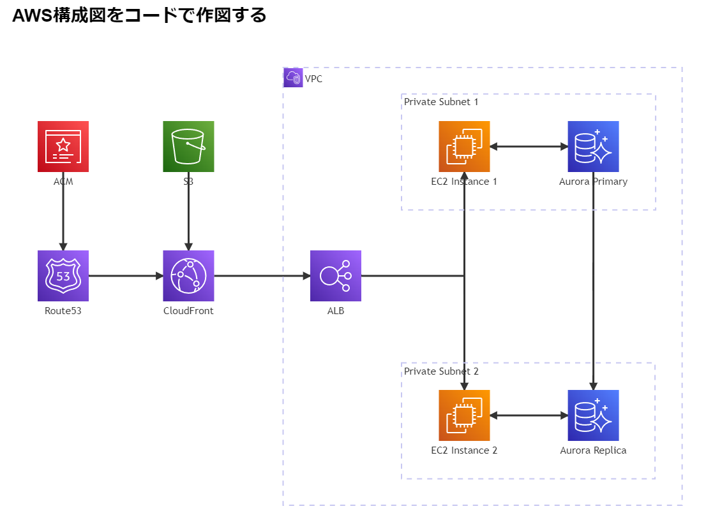

# simple-mermaid-aws
AWSの構成図をMermaid記法でシンプルに書こう

## 参考サイト
[[Mermaid]MermaidでAWS構成図を書く](https://zenn.dev/xoxo/articles/f075f2b252280b)

## 前提
1. Visual Studio Code インストール済み
1. 以下の拡張機能をインストールする
1. Markdown Preview Mermaid Support
1. Markdown Preview Enhanced

## 手順

1. VSCode上で、コマンドパレット([Ctrl] + [Shift] + [P])から、「Markdown Preview Enhanced: Customize Preview HTML Head (Global)」を選択。
```
Markdown Preview Enhanced: Customize Preview HTML Head (Global)
```

2. 以下のコードをペースト
```
<!-- The content below will be included at the end of the <head> element. -->
<script type="text/javascript">
  const configureMermaidIconPacks = () => {
    window["mermaid"].registerIconPacks([
      {
        name: "logos",
        loader: () =>
          fetch("https://unpkg.com/@iconify-json/logos/icons.json").then(
            (res) => res.json()
          ),
      },
    ]);
  };
    
  // ref: https://stackoverflow.com/questions/39993676/code-inside-domcontentloaded-event-not-working
  if (document.readyState !== 'loading') {
    configureMermaidIconPacks();
  } else {
    document.addEventListener("DOMContentLoaded", () => {
      configureMermaidIconPacks();
    });
  }
</script>
``` 


## AWS構成図をコードで作図する

``` mermaid
architecture-beta
    service dns(logos:aws-route53)[Route53]
    service cdn(logos:aws-cloudfront)[CloudFront]
    service cert(logos:aws-certificate-manager)[ACM]

    service storage(logos:aws-s3)[S3]

    group vpc(logos:aws-vpc)[VPC]

    service loadbalancer(logos:aws-elb)[ALB] in vpc

    group private_subnet1[Private Subnet 1] in vpc
    service appserver1(logos:aws-ec2)[EC2 Instance 1] in private_subnet1
    service db_primary(logos:aws-aurora)[Aurora Primary] in private_subnet1

    group private_subnet2[Private Subnet 2] in vpc
    service appserver2(logos:aws-ec2)[EC2 Instance 2] in private_subnet2
    service db_replica(logos:aws-aurora)[Aurora Replica] in private_subnet2

    junction asg_junction in vpc
    junction aurora_junction in vpc

    dns:R --> L:cdn
    cdn:R --> L:loadbalancer
    loadbalancer:R -- L:asg_junction
    asg_junction:T --> B:appserver1
    asg_junction:B --> T:appserver2
    appserver1:R <--> L:db_primary
    appserver2:R <--> L:db_replica
    cdn:T <-- B:storage

    db_replica:T <-- B:aurora_junction
    aurora_junction:T -- B:db_primary

    cert:B --> T:dns
```


## ローカルプレビューだといい感じなんだけどね
